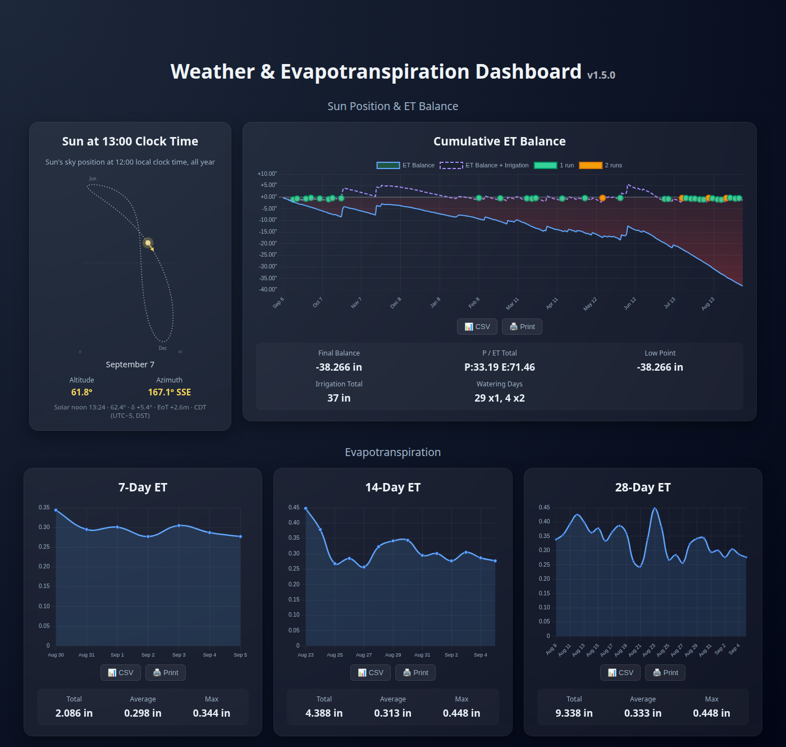
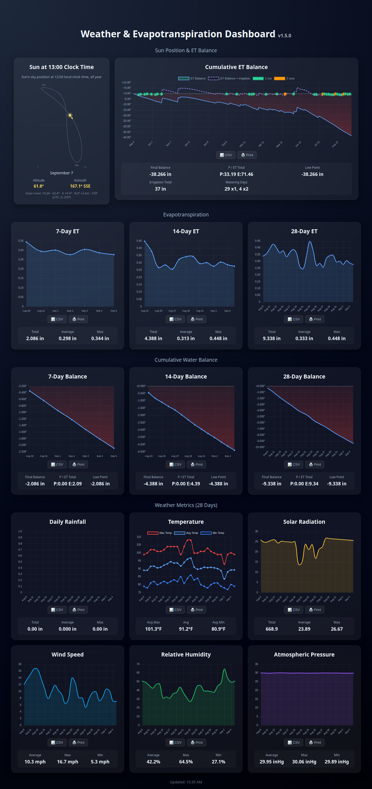
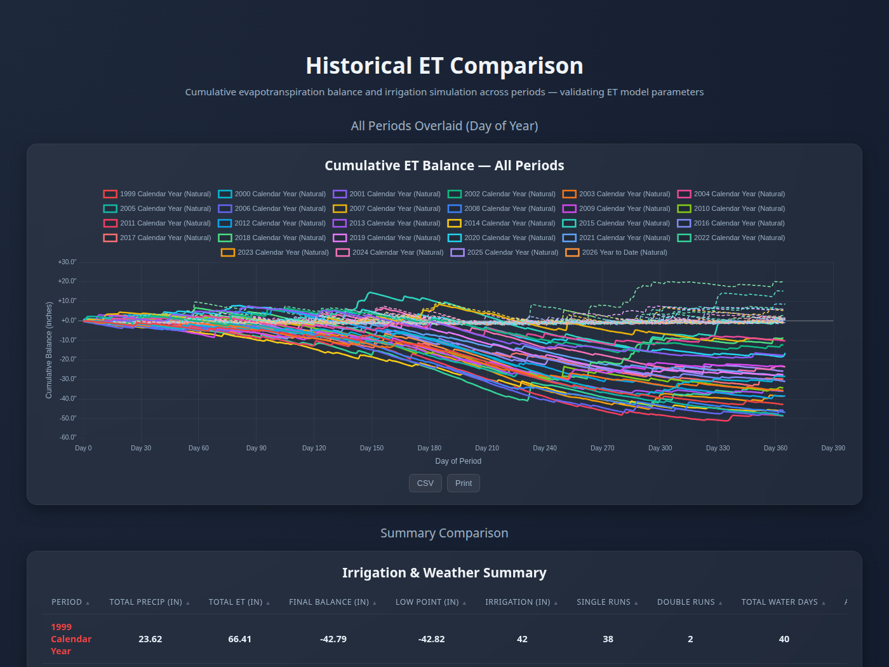
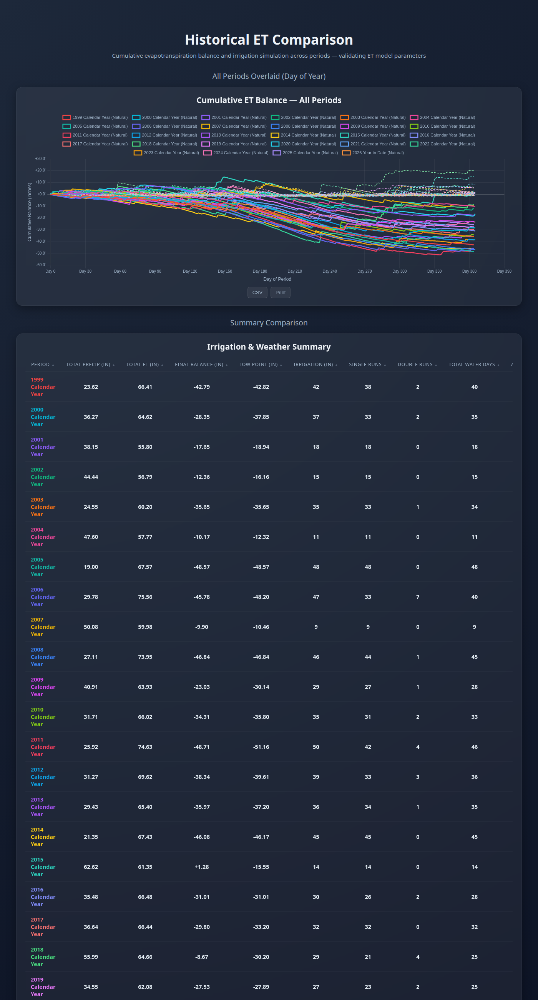

# Evapotranspiration Dashboard

**Know whether your lawn actually needs water this week, from free public weather data, with no sensors in the yard.**

[](LICENSE)
[](https://github.com/abrinlee/Evaptranspiration/commits/main)




## What it answers

- **Should I run the sprinklers?** A running water balance of rain minus evapotranspiration, with a simulated twice-weekly schedule showing when a rule like "water when 1.25 in behind" would have fired.
- **How much water has my landscape actually lost?** Daily FAO-56 Penman-Monteith reference ET₀, the same standard agricultural irrigation districts use, computed for your coordinates.
- **Is this year unusual?** Every year on record overlaid on one chart, with rain, ET, deficit, and simulated irrigation totals side by side. The author's copy runs back to 1998.

## Why you might want this

- **No hardware.** Temperature, dewpoint, wind, and pressure come from the nearest airport's hourly reports. Rainfall comes from NOAA's official daily record. Solar radiation comes from NASA satellites. All free, all public, none of it needs an account except one free NOAA token.
- **Works almost anywhere.** Any airport in the IEM archive, which covers the US and much of the world, and NASA POWER is global. Change six lines in a config file to move it.
- **Decades of history in an afternoon.** The backfill mode pulls years of hourly data in polite 30-day chunks and validates each one before writing.
- **Small and boring to run.** One Python script on a nightly cron, one MariaDB table, two PHP files, two HTML pages. It runs happily on a Raspberry Pi. No cloud, no framework, no build step. You own the data.
- **Honest about what it is.** The ET math follows FAO-56 exactly and is documented equation by equation. The water balance is a reference-crop trend, not a soil-moisture model, and the README says so.

## What you'll need

A Linux box that stays on, about an hour, and a free NOAA token. The full walkthrough starts at [Install, step by step](#install-step-by-step).

## Screenshots

<details>
<summary><b>Main dashboard, full page</b> (7/14/28-day ET, water balances, and 28 days of rain, temperature, solar, wind, humidity, pressure)</summary>



</details>

<details>
<summary><b>Historical comparison</b> (every year overlaid by day of year, plus a sortable summary table)</summary>





</details>

## Data sources

| Source | Provides | Coverage | Account needed |
|---|---|---|---|
| [IEM ASOS archive](https://mesonet.agron.iastate.edu/request/download.phtml) | hourly temperature, dewpoint, wind, altimeter, precipitation | US airports and many international METAR networks, 1990s onward | none |
| [NOAA Climate Data Online (GHCND)](https://www.ncdc.noaa.gov/cdo-web/) | official daily precipitation | global | free token |
| [NASA POWER](https://power.larc.nasa.gov/) | daily global horizontal irradiance | global, 1984 onward, about a week behind | none |

---

## Contents

0. [What it answers](#what-it-answers) · [Why you might want this](#why-you-might-want-this) · [Screenshots](#screenshots)
1. [How it works](#how-it-works)
2. [Requirements](#requirements)
3. [Install, step by step](#install-step-by-step)
4. [Configuration reference](#configuration-reference)
5. [Operating it](#operating-it)
6. [Optional pieces](#optional-pieces)
7. [Adapting the irrigation rule to your yard](#adapting-the-irrigation-rule-to-your-yard)
8. [Troubleshooting](#troubleshooting)
9. [Repository layout](#repository-layout)
10. [License](#license)

---

## How it works

```
IEM ASOS (hourly)  ─┐
NOAA GHCND (daily) ─┼─► pipeline/Weather_ASOS.py ─► MariaDB weather.weather_daily
NASA POWER (daily) ─┘        (3:05 AM cron)                    │
                                                               ▼
                                     api/et-data.php, api/et-history.php (PHP, JSON)
                                                               │
                                                               ▼
                                     dashboard.html, historical_dashboard.html (Chart.js)
```

- The nightly job refreshes the trailing 365 days every run. That is deliberate:
  NASA POWER publishes about a week late, so the most recent days are first written
  with a clear-sky solar estimate (`solar_source = RA_FALLBACK`) and are rewritten
  with real data on later nights.
- The dashboard is plain HTML and JavaScript. It calls the PHP API on the same web
  server, which reads the database. No build step, no framework.
- All credentials and site settings live in **one INI file** outside the web root.
  Nothing in this repository contains a password.

---

## Requirements

**A machine that is always on** with internet access, running Linux. The instructions
below are for Ubuntu or Debian. Tested on Ubuntu 24.04 LTS on x86_64; a Raspberry Pi
running Raspberry Pi OS will work the same way with the same package names.

**Software** (versions this was built and tested against):

| Component | Tested version | Purpose |
|---|---|---|
| Apache 2.4 | 2.4.58 | serves the dashboard and runs the PHP API |
| PHP 8 with the `mysqli` extension | 8.3 | the two API endpoints |
| MariaDB 10.x (MySQL works too) | 10.11 | stores one row per day |
| Python 3.10+ | 3.12 | the nightly collector and ET math |
| git | any | to get the code |
| Mosquitto MQTT broker (optional) | 2.0 | only if you want the Home Assistant feed |

**One free account:** a NOAA Climate Data Online token, requested at
<https://www.ncdc.noaa.gov/cdo-web/token>. They email it to you within a minute.

---

## Install, step by step

### 1. Install system packages

```bash
sudo apt update
sudo apt install -y apache2 libapache2-mod-php php-mysql mariadb-server python3 python3-venv git curl
sudo systemctl enable --now apache2 mariadb
```

Lock down MariaDB and set a root password when prompted:

```bash
sudo mysql_secure_installation
```

Confirm PHP is wired into Apache and has the MySQL driver:

```bash
php -m | grep mysqli          # should print: mysqli
apache2ctl -M | grep php      # should print: php_module (shared)
```

### 2. Get the code

```bash
cd ~
git clone https://github.com/abrinlee/Evaptranspiration.git
cd Evaptranspiration
```

### 3. Create the database and two users

`schema.sql` creates the `weather` database and the `weather_daily` table.

```bash
mysql -u root -p < schema.sql
```

Create a read-only user for the web API and a read/write user for the nightly job.
Pick your own passwords; you will paste them into the config file in step 5.

```bash
mysql -u root -p <<'SQL'
CREATE USER 'weather_ro'@'localhost' IDENTIFIED BY 'choose-a-password';
GRANT SELECT ON weather.* TO 'weather_ro'@'localhost';
CREATE USER 'weather_rw'@'localhost' IDENTIFIED BY 'choose-another-password';
GRANT SELECT, INSERT, UPDATE ON weather.* TO 'weather_rw'@'localhost';
FLUSH PRIVILEGES;
SQL
```

### 4. Find your station and site values

You need six facts about where you are. Write them down; they go in the config file.

**ASOS station id** (e.g. `KDFW`). Go to
<https://mesonet.agron.iastate.edu/request/download.phtml>, choose your state's
"ASOS" network from the dropdown, and pick the airport closest to you. Use the
4-letter identifier shown. Large airports have the most complete hourly records;
small airfields sometimes report only during the day, which will hurt the daily
max/min temperatures.

**GHCND station id** (e.g. `GHCND:USW00003927`). This is the same airport's entry in
NOAA's daily climate network, used for official daily rainfall. Search at
<https://www.ncdc.noaa.gov/cdo-web/search>: dataset "Daily Summaries", search for the
airport name, and copy the id that starts with `GHCND:`. First-order airport
stations have ids of the form `USW000xxxxx`. If you cannot find one, use the ASOS id
anyway; the pipeline falls back to the airport's own hourly precipitation.

**Latitude and longitude of your yard**, not the airport. Right-click your house in
Google Maps and copy the numbers. Two decimal places is plenty (about 1 km); this
only drives the solar geometry and which NASA POWER grid cell is used, and it is
what gets committed if you ever publish your config, so don't use more precision
than you want to share.

**Elevation in meters** of your yard. Any elevation finder will do, for example
<https://www.freemaptools.com/elevation-finder.htm>. It sets atmospheric pressure in
the ET formula.

**Timezone** as an IANA name, e.g. `America/Chicago`, `America/Los_Angeles`,
`Europe/London`. It controls where the "day" boundary falls when hourly reports are
aggregated. List of names: <https://en.wikipedia.org/wiki/List_of_tz_database_time_zones>.

**NOAA token** from the Requirements section, the one NOAA emailed you.

### 5. Write the config file

The pipeline and the PHP API both read `/etc/weather-dashboard/config.ini`. It has
to be readable by the Apache user (`www-data`) and by the user whose cron job runs
the pipeline (you), and by nobody else.

```bash
sudo mkdir -p /etc/weather-dashboard
sudo cp config.example.ini /etc/weather-dashboard/config.ini
sudo chown $USER:www-data /etc/weather-dashboard/config.ini
sudo chmod 640 /etc/weather-dashboard/config.ini
sudo nano /etc/weather-dashboard/config.ini
```

Fill in the `[database]` passwords from step 3, the `[noaa]` token, and the `[site]`
values from step 4. Leave `[mqtt]` alone unless you are doing the optional Home
Assistant feed. Every key is explained in the
[configuration reference](#configuration-reference) below.

### 6. Set up the Python environment

```bash
python3 -m venv ~/myenv
~/myenv/bin/pip install -r requirements.txt
```

Check that the pipeline can see its config and database:

```bash
cd pipeline
~/myenv/bin/python Weather_ASOS.py --version
~/myenv/bin/python -c "import Weather_ASOS as w; print(w._cfg.path, w.STATION, w.LATITUDE_DEG)"
cd ..
```

### 7. Backfill history

Load as many past years as you want before turning on the nightly job. Backfill runs
in 30-day chunks with a 15-second pause between them to be polite to the IEM server,
saves a CSV for review, prints a continuity report (missing days, nulls, physics
checks), and then asks before writing to the database. One calendar year takes
roughly 3 to 5 minutes.

```bash
cd pipeline
~/myenv/bin/python Weather_ASOS.py --start 2024-01-01 --end 2024-12-31
```

Answer `y` at the prompt if the report says `CLEAN`. To run unattended, add `--yes`;
it commits only if the data is clean and refuses otherwise. Repeat for each year you
want. NASA POWER solar data exists from 1984; ASOS hourly archives vary by station
but most large airports go back to the mid-1990s. The historical dashboard is most
interesting with at least a few years loaded.

### 8. Install the nightly cron job

The wrapper script runs the collector and then the optional MQTT publisher, and
appends one line to `pipeline/weather_collection.log`.

```bash
crontab -e
```

Add this line, adjusting the path to wherever you cloned the repo:

```
5 3 * * * /home/YOU/Evaptranspiration/pipeline/run_weather_collection.sh
```

3:05 AM local time is a good choice because the previous day's hourly reports are
complete and NOAA has had time to post the daily rainfall. If your Python interpreter
is somewhere other than `~/myenv/bin/python`, set it with `PYTHON=/path/to/python`
at the front of the cron line.

Run it once by hand now so you don't have to wait until 3 AM to find a problem:

```bash
pipeline/run_weather_collection.sh
tail -3 pipeline/weather_collection.log
```

A normal run prints the last ten days and `Complete - 365 days processed` in a few
seconds. If you skipped the MQTT setup, the publisher step will print a connection
error and that is fine; the collector has already finished.

### 9. Deploy the web pages

`deploy.sh` copies `dashboard.html` and the `api/` folder into a web root and sets
ownership to `www-data`. The default web root is `/var/www/bookstack/public`
(the author serves it alongside a BookStack wiki); on a fresh Apache install the
document root is `/var/www/html`:

```bash
sudo WEB_ROOT=/var/www/html ./deploy.sh
```

Or edit the `WEB_ROOT=` default at the top of `deploy.sh` and run `sudo ./deploy.sh`.

**The API path is absolute.** The dashboard fetches `/api/et-data.php`, so `api/`
must sit at the root of whatever hostname you use. If you must serve from a
subdirectory (`http://host/et/dashboard.html`), change the two `fetch(` lines in the
HTML files from `/api/...` to `api/...`.

### 10. Verify

```bash
curl -s "http://localhost/api/et-data.php?days=3"
```

You should get JSON starting with `{"success":true,"data":[...`. Then open
`http://<server-ip>/dashboard.html` in a browser. Every card should fill within
a couple of seconds.

If instead you see `{"success":false,"error":"Config file not readable: ..."}`, the
Apache user cannot read the config; re-check the `chown` and `chmod` in step 5.

---

## Configuration reference

`/etc/weather-dashboard/config.ini`, from the template `config.example.ini`.

Search order, first hit wins:

1. the path in the environment variable `WEATHER_DASHBOARD_CONFIG`
2. `/etc/weather-dashboard/config.ini`
3. `~/.config/weather-dashboard/config.ini` (pipeline only, not the PHP)

| Section | Key | Meaning |
|---|---|---|
| `database` | `host` | MariaDB host, normally `localhost` |
| | `name` | database name, `weather` unless you edited `schema.sql` |
| | `user`, `password` | read-only account used by the PHP API and the MQTT publisher |
| | `writer_user`, `writer_password` | read/write account used by the nightly collector |
| `noaa` | `token` | your NOAA Climate Data Online token |
| `mqtt` | `broker`, `port`, `username`, `password`, `topic_prefix` | only for the optional Home Assistant feed; leave username blank for an open broker |
| `site` | `station` | ASOS 4-letter id |
| | `ghcnd_station` | matching `GHCND:...` id for official daily precipitation |
| | `latitude`, `longitude` | decimal degrees of the place you irrigate; west and south are negative |
| | `elevation_m` | meters above sea level |
| | `timezone` | IANA timezone name |

A change to the config takes effect on the next pipeline run and the next API
request. Nothing needs to be redeployed.

---

## Operating it

**Logs.** `pipeline/weather_collection.log` gets one line per nightly run. The
collector's full output (the ten-day summary, any `[PHYSICS]` or `[NASA]` notices)
goes to cron, which mails it to the local user or discards it depending on how the
system is set up. To keep it, append `>> /path/to/pipeline/cron_output.log 2>&1` to
the cron line.

**Provisional days.** The most recent 7 to 9 days carry `solar_source = RA_FALLBACK`
and an ET that runs about 13 percent high on average, more on cloudy days. They are
corrected automatically as NASA data arrives. Over a season the effect on the
irrigation simulation cancels out; it only shifts the occasional watering day one
cycle earlier.

**Updating the code.**

```bash
cd ~/Evaptranspiration && git pull
sudo WEB_ROOT=/var/www/html ./deploy.sh      # only needed if HTML or PHP changed
```

The pipeline picks up changes on its next run; nothing to restart.

**Checking data freshness.** The newest row should be yesterday:

```bash
mysql -u weather_ro -p weather -e "SELECT MAX(date), COUNT(*) FROM weather_daily;"
```

**Recomputing ET for all history.** Every input the formula needs is stored in the
table, so if you change the ET math you can re-run a backfill over any date range
and the rows are overwritten in place.

---

## Optional pieces

### Home Assistant via MQTT

`pipeline/publish_weather_to_mqtt_db.py` publishes the last 30 days, a summary, the
latest day, and a data-quality count as retained JSON messages under
`weather/30day/...`. Install a broker and fill in `[mqtt]`:

```bash
sudo apt install -y mosquitto mosquitto-clients
sudo systemctl enable --now mosquitto
```

The wrapper script already calls the publisher after each nightly run. Test it:

```bash
cd pipeline && ~/myenv/bin/python publish_weather_to_mqtt_db.py
mosquitto_sub -h localhost -t 'weather/30day/summary' -C 1
```

In Home Assistant, add MQTT sensors pointed at those topics with a `value_template`
for the field you want.

### Historical year-over-year dashboard

`historical_dashboard.html` fetches every calendar year from 1999 to the current
year on load and overlays them. It uses the same absolute `/api/` path, so it has to
be served from the same web server as the API; opening the file directly from disk
will not work. `deploy.sh` leaves it out on purpose because it is heavy; copy it by
hand if you want it on the server:

```bash
sudo install -o www-data -g www-data -m 644 historical_dashboard.html /var/www/html/
```

Years with no data in the table simply show as empty lines. To change the range,
edit the `PERIODS` array near the top of the script block.

### Hosting Chart.js locally

The pages load Chart.js 4.4.0 and three plugins from jsDelivr. If the server has no
outbound internet for browsers, download those four files into an `assets/js/`
folder under the web root and change the four `<script src=` lines; the exact URLs
are listed in `context.md` under "Dependencies".

---

## Adapting the irrigation rule to your yard

The 365-day balance card simulates a sprinkler schedule and reports how much water
it would have applied. The rule is hard-coded and reflects one city's twice-weekly
watering restriction and one sprinkler system:

- watering allowed on **Monday and Thursday** (`dow === 1 || dow === 4`)
- a run is triggered when the cumulative balance is at or below **−1.25 in**
- each run applies **1.0 in**, at most two runs per allowed day

The constants live in `createYearlyBalanceChart()` in `dashboard.html` and in
`simulateIrrigation()` in `historical_dashboard.html`. Change the day numbers
(Sunday is 0), the trigger, and the dose to match your rules and your system's
precipitation rate.

Be aware of what the balance is and is not. It is cumulative rain minus
**reference** ET for a well-watered short grass. It has no crop coefficient and no
cap for how much water the soil can hold, so a wet spring "banks" a surplus that
real soil would have drained away. It is a useful trend, not a soil-moisture model.

---

## Troubleshooting

`context.md` has the long-form reference: the full ET₀ derivation with every
FAO-56 equation used, typical ET ranges by season, SQL queries for finding missing
inputs, and a troubleshooting section for each failure mode (dashboard stuck on
"Loading", empty API, wrong-looking ET values, CDN blocked).

The three most common problems on a new install:

| Symptom | Cause |
|---|---|
| API returns `Config file not readable` | Apache's `www-data` user can't read `/etc/weather-dashboard/config.ini`; check `chown` and `chmod 640` |
| API returns `Connection failed: Access denied` | wrong database password in the config, or the users from step 3 weren't created |
| Dashboard cards say `Error: No data available` | the table is empty; run a backfill (step 7) or the nightly job once by hand |

---

## Repository layout

```
dashboard.html                          main dashboard
historical_dashboard.html               year-over-year comparison (optional, deploy by hand)
api/et-data.php                         JSON, last N days
api/et-history.php                      JSON, arbitrary date range
pipeline/Weather_ASOS.py                nightly collector, ET₀ math, historical backfill
pipeline/publish_weather_to_mqtt_db.py  optional Home Assistant/MQTT publisher
pipeline/run_weather_collection.sh      cron wrapper
pipeline/config.py                      config loader shared by the pipeline scripts
schema.sql                              database and table definition
config.example.ini                      template for the one config file
requirements.txt                        Python dependencies
deploy.sh                               copies dashboard + API into the web root
context.md                              long-form reference and troubleshooting
LICENSE                                 GPL-3.0
```

---

## License

GPL-3.0. See `LICENSE`.
